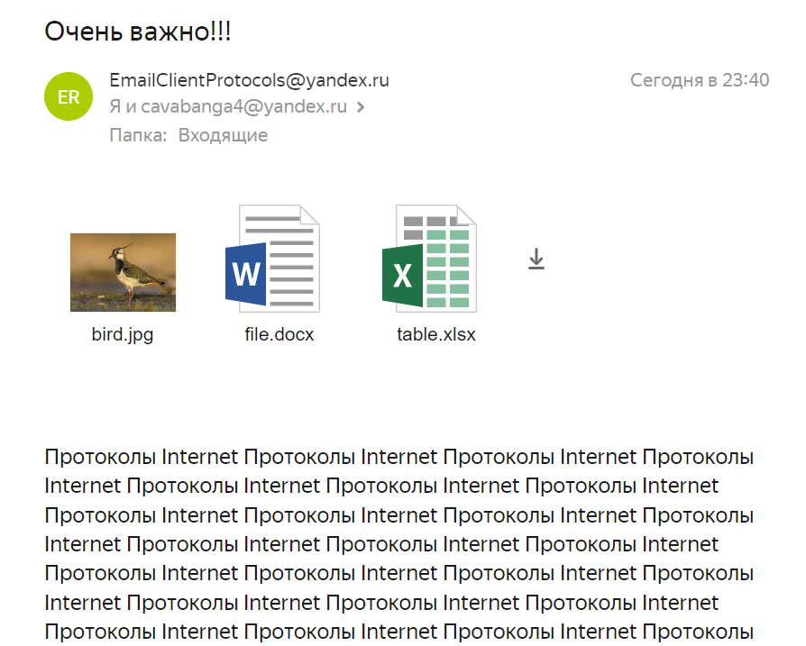

 # SMTP клиент
 Короткова Мария КН-201

 Постановка задачи:
 >В отдельной папке лежит конфигурационный файл,
текстовый файл с письмом и файлы-аттачменты (картинки, документы и т. д.). В текстовом фале пользователь пишет письмо (plain text) на английском или русском языке. В конфигурационном файле пользователь задает адрес получателя(лей), тему (возможно на русской языке) и
имена файлов-аттачментов для отсылки в виде вложения.
 

Запуск программы:
>py main.py

Результаты работы программы:

